## ClientFirst-XAI: Client Satisfaction Prediction & Explanation

## Table of Contents
- [About the Project](#about-the-project)
- [Features](#features)
- [Technologies Used](#technologies-used)
- [Getting Started](#getting-started)
  - [Prerequisites](#prerequisites)
  - [Local Development](#local-development)
- [Deployment on Render](#deployment-on-render)
- [API Endpoints](#api-endpoints)
- [Project Structure](#project-structure)
- [Future Enhancements](#future-enhancements)
- [Contributing](#contributing)
- [License](#license)
- [Contact](#contact)

---

## About the Project
ClientFirst-XAI is an intelligent application designed to predict and explain client satisfaction in clinical settings, specifically within an HIV clinic context. It uses machine learning and rule-based systems to provide insights into satisfaction drivers, along with actionable suggestions for quality improvement.

## Features
* **Client Satisfaction Prediction**
* **SHAP-based Feature Importance**
* **Rule-Based Explanations**
* **Generative AI Synthesis**
* **Interactive Dashboard**
* **FastAPI Backend**
* **Static Web Pages**

## Technologies Used

**Backend:**
* Python 3.9+
* FastAPI
* scikit-learn
* pandas
* numpy
* shap
* requests
* python-dotenv
* python-multipart

**Frontend:**
* HTML5
* CSS3
* JavaScript

**Deployment:**
* Render

**AI Service:**
* OpenRouter

## Getting Started

### Prerequisites
* Python 3.9+
* `pip`
* `venv`
* Git

### Local Development
1. Clone the repository:
    ```bash
    git clone https://github.com/AHFIDAILabs/ClientFirst-XAI.git
    cd ClientFirst-XAI
    ```
2. Create and activate a virtual environment:
    ```bash
    python -m venv venv
    # Windows:
    .\venv\Scripts\activate
    # macOS/Linux:
    source venv/bin/activate
    ```
3. Install dependencies:
    ```bash
    pip install -r requirements.txt
    ```
4. Set up environment variables:
    Create a `.env` file and add:
    ```
    SATISFACTION_APP_KEY="your_openrouter_api_key_here"

    SENDER_EMAIL="your_new_app_email@gmail.com"
    SENDER_PASSWORD="your_16_digit_app_password"
    ```

5. Run the application:
    ```bash
    uvicorn app.api:app --reload --host 0.0.0.0 --port 8000
    ```

6. Access locally:
* Home: `http://127.0.0.1:8000/`
* Dashboard: `http://127.0.0.1:8000/dashboard`
* Contact: `http://127.0.0.1:8000/contact`
* FAQ: `http://127.0.0.1:8000/faq`
* Swagger Docs: `http://127.0.0.1:8000/docs`
* ReDoc: `http://127.0.0.1:8000/redoc`

## Deployment on Render

1. Push the repository to GitHub.
2. Create a [Render](https://render.com/) account.
3. From your Render dashboard, click **"New Web Service"**.
4. Connect your GitHub repo and select your project.
5. Set the following settings:
    - **Environment**: Python
    - **Build Command**: `pip install -r requirements.txt`
    - **Start Command**: `uvicorn app.api:app --host 0.0.0.0 --port 10000`
6. Add the environment variable:
    - `SATISFACTION_APP_KEY = your_openrouter_api_key`
7. Click **Create Web Service** and wait for deployment to complete.

Your app will be live at something like:  
`https://clientfirst-xai.onrender.com`

## API Endpoints

* `/` (GET): Static home page  
* `/dashboard` (GET): Client satisfaction dashboard
* `/contact` (GET): Contact Us page
* `/faq` (GET): FAQ page  
* `/api/categories` (GET): Returns categorical features and their values  
* `/api/predict_explain` (POST): Accepts client data and returns predictions with explanations
* `/api/send-message` (POST): Message submission      

### Request Example
```json
{
    "Age": 35,
    "Gender": "Female",
    "Employment_Grouped": "Employed",
    "Education_Grouped": "Higher Education",
    "Facility_Care_Dur_Years": 5,
    "HIV_Care_Duration_Ratio": 0.8,
    "Empathy_Listening_Interaction": 12,
    "Empathy_DecisionShare_Interaction": 13,
    "Exam_Explained": 3,
    "Discuss_NextSteps": 3
}
```

### Response Example
```json
{
    "prediction": "Satisfied",
    "confidence": "92.5%",
    "top_features": {
        "Empathy_Listening_Interaction": 0.52,
        "HIV_Care_Duration_Ratio": 0.31,
        "Facility_Care_Dur_Years": 0.25
    },
    "reasons": [
        "Strong empathy and active listening boosted client satisfaction."
    ],
    "suggestions": [
        "Encourage continued focus on empathetic listening."
    ],
    "genai_explanation": "### 1. Executive Summary\nThis client is predicted to be 'Satisfied' with a high confidence of 92.5%. The primary drivers of this satisfaction are strong empathetic communication and active listening during interactions, along with a positive history in HIV care duration and overall facility care duration.",
    "shap_values": [0.1, -0.05, "..."],
    "shap_base_value": -0.8,
    "feature_values": [35, "Female", "..."],
    "feature_names": ["Age", "Gender", "..."]
}
```

## Project Structure

```mermaid
graph TD
    A[ClientFirst-XAI]
    A --> B[app/]
    B --> B1[__init__.py]
    B --> B2[api.py]
    B --> B3[explanation_engine.py]
    B --> B4[model_utils.py]

    A --> C[assets/]
    C --> C1[documentation.md]

    A --> D[data/]
    D --> D1[processed_data.csv]

    A --> E[model/]
    E --> E1[categories.joblib]
    E --> E2[important_features.joblib]
    E --> E3[label_encoder.joblib]
    E --> E4[top_categorical_features.joblib]
    E --> E5[top10_model.joblib]

    A --> F[notebooks/]
    F --> F1[01_data_conversion.ipynb]
    F --> F2[02_data_transformation.ipynb]
    F --> F3[03_data_synthesis_CTGAN.ipynb]
    F --> F4[04_data_modelling_&_explanation.ipynb]

    A --> G[static/]
    G --> G1[contact.html]
    G --> G2[dashboard.html]
    G --> G3[faq.html]
    G --> G4[index.html]
    G --> G5[style.css]
    G --> H[images/]
    H --> H1[ahfid.png]
    H --> H2[background.jpg]
    H --> H3[customer-satisfaction.jpg]
    H --> H4[icons.jpg]

    A --> I[.env]
    A --> J[.gitignore]
    A --> K[Dockerfile]
    A --> L[README.md]
    A --> M[render.yaml]
    A --> N[requirements.txt]
    A --> O[train_model.py]
```



```
ClientFirst-XAI/
├── app/
│   ├── __init__.py
│   ├── api.py
│   ├── explanation_engine.py
│   └── model_utils.py
├── assets/
│   └── documentation.md
├── data/
│   └── processed_data.csv
├── model/
│   ├── categories.joblib
│   ├── important_features.joblib
│   ├── label_encoder.joblib
│   ├── top_categorical_features.joblib
│   └── top10_model.joblib
├── notebooks/
│   ├── 01_data_conversion.ipynb
│   ├── 02_data_transformation.ipynb 
│   ├── 03_data_synthesis_CTGAN.ipynb
│   └── 04_data_modelling_&_explanation.ipynb
├── static/
│   ├── contact.html
│   ├── dashboard.html
│   ├── faq.html
│   ├── index.html
│   ├── style.css
│   └── images/
│       ├── ahfid.png
│       ├── background.jpg
│       ├── customer-satisfaction.jpg
│       └── icons.jpg  
├── .env
├── .gitignore
├── Dockerfile
├── README.md
├── render.yaml
├── requirements.txt
└── train_model.py 
```

## Future Enhancements
* Stronger input validation
* Authentication system
* Satisfaction trend analysis
* Database for persistent storage
* Expanded rule engine
* Improved dashboard design
* Model retraining pipeline

## Contributing

1. Fork the repo  
2. Create a branch: `git checkout -b feature/my-feature`  
3. Commit your changes  
4. Push the branch: `git push origin feature/my-feature`  
5. Open a Pull Request  

## License
MIT License. See `LICENSE` file.

## Contact
**AHFID AI & Social Informatics Team**  
Email: aiteam@ahfid.org 
Project: [GitHub - ClientFirst-XAI](https://github.com/AHFIDAILabs/ClientFirst-XAI)

Made with ❤️ by Wale Ogundeji