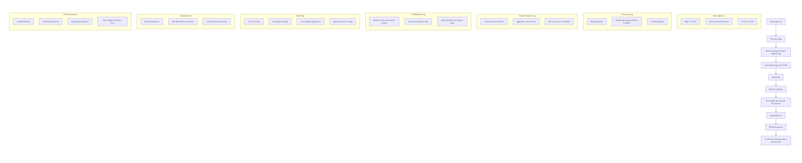

# HIV Project Technical Documentation

## 1. Project Overview

The project processes raw HIV client survey data from `.sav` format, cleans and standardizes it, merges multiple datasets, engineers new features, addresses class imbalance with synthetic data generation (CTGAN), builds predictive models, and deploys a web application (ClientFirst-XAI) with explainable AI capabilities.

---

## 2. Data Workflow Diagram


```
flowchart TD
    A[Data Ingestion] --> B[Preprocessing]
    B --> C[Data Cleaning & Feature Engineering]
    C --> D[Class Balancing with CTGAN]
    D --> E[Modelling]
    E --> F[Model Evaluation]
    F --> G[Best Model Selection & Persistence]
    G --> H[Explainable AI]
    H --> I[API Development]
    I --> J[ClientFirst-XAI Application Deployment]

    subgraph A1[Data Ingestion]
        A1a[Read .sav Files]
        A1b[Drop Irrelevant Columns]
        A1c[Convert to CSV]
    end
    
    subgraph B1[Preprocessing]
        B1a[Merge Datasets]
        B1b[Standardize Column Names & Values]
        B1c[Fill Missing Data]
    end

    subgraph C1[Feature Engineering]
        C1a[Create Derived Features]
        C1b[Aggregate Likert Scores]
        C1c[Interaction Terms & Ratios]
    end

    subgraph D1[CTGAN Balancing]
        D1a[Identify Underrepresented Classes]
        D1b[Generate Synthetic Data]
        D1c[Merge Synthetic & Original Data]
    end

    subgraph E1[Modelling]
        E1a[Train-Test Split]
        E1b[Scaling & Encoding]
        E1c[Train Multiple Algorithms]
        E1d[Hyperparameter Tuning]
    end

    subgraph H1[Explainable AI]
        H1a[SHAP Explanations]
        H1b[Rule-Based Interpretations]
        H1c[LLM Narrative Generation]
    end

    subgraph I1[API Development]
        I1a[FastAPI Backend]
        I1b[Prediction Endpoint]
        I1c[Explanation Endpoint]
        I1d[Static Pages & Contact Form]
    end
```
---

## 3. Data Import and Conversion

**Step 1: Library Imports**
Imported `pandas`, `pyreadstat`, `os`, and `spss_converter` modules to handle SPSS data, data wrangling, and file operations to save the data in CSV for easier processing.

**Step 2: File Directory Setup**
Specified directories for `.sav` input files and CSV outputs.

**Step 3: Read ************************************************************************************************************************************************************************************************************************************************************************************************************************************************************************************************************************************************************************************************************************************************************************`sav`************************************************************************************************************************************************************************************************************************************************************************************************************************************************************************************************************************************************************************************************************************************************************************ Files**
Loaded `client_data0.sav` and `client_data1.sav` with `pd.read_spss` in pandas DataFrame for further analysis.

**Step 4: Column Removal**
Dropped irrelevant metadata columns (e.g., submission date, device info) to removes noise and potential privacy-sensitive information, keeping only analytical features.

**Step 5: CSV Conversion**
Saved cleaned DataFrames as CSV for easier handling. CSV is a more portable, widely supported format for subsequent processing.

---

## 4. Data Merging and Transformation

**Step 6: Combine Datasets**
Concatenated `df_client0` and `df_client1`. Both datasets represent similar records from different sources; combining allows unified analysis.

**Step 7: Column Consolidation**
Merged `Edulevel` and `EduLevel` values, replacing “Other (please specify)” values to reduces redundancy and preserves important custom input values.

**Step 8: Value Normalization**
Standardized variants of Islamic education to `Islamic education` to improves data consistency and avoids splitting categories.

**Step 9: Missing Data Handling**
Filled missing `numb` based on family setting and replaced remaining nulls, with most common category to ensure completeness of categorical data, especially for demographic analysis..

**Step 10: Feature Engineering**
Derived `State` from `EnumID` by mapping known prefixes to state names and extracting geographic information from enumeration codes for location analysis..

**Step 11: State Data Cleaning**
Replaced `Other/Unknown` with `Jigawa` where appropriate based on enumeration codes to corrects misclassified records without losing potentially valuable data..

---

## 5. Column Standardization

**Step 12: Renaming Columns**
Mapped original column names to more descriptive, human-readable labels to improves clarity for analysis and reporting.

**Step 13: Column Reordering**
Reorganized columns for logical readability, starting with identifiers, demographics, and then survey responses to make datasets more intuitive to read and process in downstream models.

---

## 6. Class Balancing with Synthetic Data (CTGAN)

**Step 14: Load Final Dataset**
Read `clients_data.csv`, the cleaned dataset ready for modeling..

**Step 15: Filtering and Cleaning**
Retained only valid states and removed missing satisfaction values, , and dropped `EnumID` for modeling.

**Step 16: Synthetic Data Generation**
Generated synthetic samples for underrepresented satisfaction categories (`Satisfied`, `Neutral`, `Very dissatisfied`) using CTGAN. Balances class distribution, which improves fairness and performance in classification tasks.

**Step 17: Metadata Handling**
Explicitly marked categorical columns in `SingleTableMetadata` to ensure CTGAN correctly models discrete variables.

.

**Step 18: Synthetic Sample Merging**
Added synthetic IDs and combined with original data, labeled data source (`Original` or `Synthetic`), and merged datasets to preserves traceability and ensures the dataset is well-balanced.

**Step 19: Dataset Export**
Saved final balanced dataset as `balanced.csv`, produces a ready-to-use dataset for analysis or machine learning.

---

## 7. Synthetic Data Evaluation

**Step 20: Diagnostic Testing**
Ran `run_diagnostic` to validate synthetic data schema and constraints (Achieved 100% in data validity and structure). This confirms that synthetic data respects the schema and constraints of the original data. 

**Step 21: Quality Evaluation**
Assessed column shapes and pair trends  with "evaluate\_quality". Scores were 84.67% and 71.9%, averaging 78.28%. This shows that synthetic data mimics the original data distribution and relationships closely enough for practical use.

---

## 8. Data Cleaning and Feature Engineering

**Step 22: Data Transformation for Modelling**
Converted categorical ranges for `Age`, `Num of Children`, `Monthly Income`, and HIV care duration fields into numeric midpoints. Many ML models require numeric inputs; midpoints approximate category positions without losing order.

**Step 23: Missing Data Treatment**
Added missing indicator for `Monthly Income` and imputed missing values with the median. This preserves information about missingness while ensuring models have complete numeric data.

**Step 24: Outlier Handling**
Used Z-scores to detect outliers in continuous features and applied log transformations only where needed to reduces skewness and minimizes extreme value influence

**Step 25: Likert Scale Standardization**
Cleaned survey response text (trimmed spaces, standardized casing) and converted to numeric scores to facilitates computation of aggregate satisfaction measures and consistent model input.

**Step 26: Grouped Categorical Variables**
Created simplified groupings for education, employment, and marital status to reduces category sparsity and improves model stability.

**Step 27: Interaction Features and Ratios**
Created ratios like `HIV_Care_Duration_Ratio` and product terms (interaction terms) such as `Age_x_HIV_Duration` to captures nuanced relationships between demographic and clinical features.

**Step 28: Subscore Creation**
Aggregated Likert questions into composite measures to compute `Empathy_Score`, `Listening_Score`, `Decision_Share_Score`, `Info_Delivery_Score` to provides higher-level behavioral indicators for the model.

**Step 29: Profile Flags**
Added binary indicators (`All_High_Satisfaction` and `Any_Low_Score`) for satisfaction extremes. This could enables quick identification of extreme satisfaction profiles.

**Step 30: Duplicate Removal**
Removed duplicates ignoring `EnumID` to ensure no repeated observations bias the model.

---

## 9. Modelling

**Step 31: Train-Test Split**
Split into 80% training and 20% testing with stratification on satisfaction levels. This is to maintain class proportions and ensure fair model evaluation.

**Step 32: Preprocessing Pipeline**
Applied `StandardScaler` to numeric features and `OrdinalEncoder` to categorical features. Standardization improves gradient-based model performance; encoding ensures numeric representation for categorical features.

**Step 33: Class Weight Computation**
Calculated balanced class weights to counteract residual class imbalance. This is to prevent bias toward majority classes during training.

**Step 34: Model Training and Hyperparameter Tuning**
Trained and tuned multiple algorithms:

* RandomForestClassifier (RandomizedSearchCV)
* XGBoostClassifier (GridSearchCV with sample weights)
* LightGBMClassifier (GridSearchCV)
* CatBoostClassifier (GridSearchCV with native categorical handling)

This is to ensure diverse algorithmic exploration to select the best-performing approach.

**Step 35: Model Evaluation Metrics**
Used Accuracy, Macro-F1, and Log Loss as scoring metrics. Balances focus between classification correctness, balance across classes, and probability calibration.

**Step 36: Feature Importance Analysis**
Extracted top 10 contributing features for each model to enhance interpretability and feature engineering feedback loop.

**Step 37: Best Model Selection**
Selected **CatBoost** as the final model based on a weighted combination of F1 and Log Loss. **CatBoost** achieved best combined performance and handles categorical variables efficiently.

**Step 38: Model Persistence**
Saved tuned CatBoost with `joblib` to facilitate deployment without retraining.

---

## 10. Explainable AI (XAI) Pipeline

**Step 39: SHAP Integration**
Used SHAP TreeExplainer for local explanations of individual predictions. It provides transparency on which features drove each prediction.

**Step 40: Rule-Based Explanation Layer**
Added domain-informed rules for empathy, decision sharing,  communication, exam explanation, and overall satisfaction. This combines data-driven insights with expert rules for richer interpretation.

**Step 41: Generative AI Narrative**
Used an LLM via OpenRouter API to convert technical explanations to generate human-readable narratives. This is to deliver actionable insights for clinical quality improvement teams.

---

## 11. Application Development – ClientFirst-XAI

**Step 42: Framework and API Design**
Built a FastAPI backend serving prediction and explanation endpoints to provides a scalable, asynchronous API suitable for integration with front-end dashboards.

**Step 43: Input Schema**
Pydantic models for input validation. Defined Pydantic models for strict input validation to ensure incoming data matches model requirements.

**Step 44: Static Content and Routes**
Served HTML templates for homepage, dashboard, contact, and FAQ pages to enables both API and human-friendly web interaction.

**Step 45: Contact Form with SMTP Integration**
Implemented /send-message to send emails via Gmail SMTP with credentials from .env to facilitate user feedback and support requests.

**Step 46: Categories Endpoint**
Provided category lists (/api/categories) to populate dropdowns in the UI dynamically, keeping front-end aligned with model category encodings.

**Step 47: Prediction + Explanation Endpoint**
/api/predict_explain processes user input, runs model inference, and returns SHAP + rule-based + AI-generated explanations to deliver both prediction and interpretability in one call.

**Step 48: Deployment Considerations**
Structured app for containerization and potential cloud deployment (e.g., Docker + Azure/GCP) to ensure reproducibility and scalability in production.

---

## Final Outputs
* Cleaned raw SPSS survey data
* Merged dataset with standardized columns
* Balanced dataset with synthetic augmentation
* Evaluation reports confirming synthetic data quality
* Cleaned, merged, and balanced dataset.
* Trained CatBoost model with best performance.
* SHAP and rule-based explanation system.
* FastAPI-based ClientFirst-XAI application ready for deployment.
